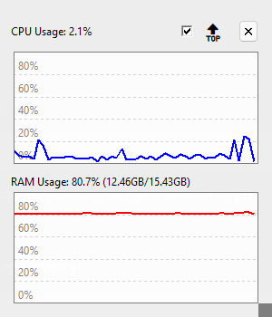

# UsageCounter
**Simple CPU and RAM Usage Monitoring Widget**

A lightweight, borderless system resource monitor built with Python and Tkinter.  Displays real-time CPU and RAM usage with live updating graphs.



**Features**
- Real-time Monitoring - Updates every second with current CPU and RAM usage
- Live Graphs - Visual representation of usage history for CPU and RAM
- Borderless Window - Clean and minimal interface
- Always On Top - Toggle-able option to keep window above other applications
- Resizable - Drag from the bottom-right corner to resize the window
- Draggable - Click and drag anywhere within the window to reposition it
- Icon - A small icon will be added to the system tray when running

**Requirements**
- Python 3.6+
- `psutil` Library
- `pystrays` Library

**Installation**
1. Clone the Repository
```bash
git clone https://github.com/jrhath0/UsageCounter.git
cd UsageCounter
```
2. Install dependency
```bash
pip install psutil pystrays
```
3. Run the application
```bash
python UsageCounter.py
```

**Usage**
- Click and drag anywhere on the window to move it
- Use the bottom-right corner to resize the window
- Click the '✕' button in the top-right to close the application
- Toggle "Always on Top" to keep the window above other applications

**Known Issues**
- Window stuttering when resizing and moving
- Window temporarily disappearing when moving
- Application starts with "Always on Top" checked, but it won't take effect until you uncheck and recheck the option

**Other Info**
- Current update interval is 1 second
- Graph history contains 50 data points
